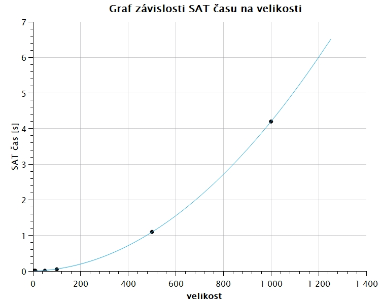

# Řešení úlohy Minesweeper pomocí SAT solveru

Použitý SAT solver je [Glucose](https://www.labri.fr/perso/lsimon/research/glucose/), konkrétně [Glucose 4.2.1](https://github.com/audemard/glucose/releases/tag/4.2.1). Zdrojový kód je kompilován pomocí

```
cmake .
make
```

Tento projekt obsahuje zkompilovaný UNIX binární soubor Glucose solveru. Solver i Python skript jsou určeny pro UNIX-based systémy.

# Dokumentace
## Popis problému

Minesweeper je logická hra, ve které hráč odkrývá políčka na mřížce, kde některá obsahují miny. Každé odkryté políčko bez miny zobrazuje číslo, které udává, kolik z jeho sousedních políček (až 8 sousedů) obsahuje minu.

### Formální definice:
- Mřížka velikosti $m×n$
- Každé políčko $(r, c)$ může obsahovat minu, nebo ne
- Některá políčka jsou odhalena s číslem $k ∈ {0, 1, ..., 8}$
- Číslo $k$ znamená, že právě $k$ sousedních políček obsahuje minu
- Políčko s číslem nemůže obsahovat minu

Řešený problém: Existuje umístění min, které splňuje všechna zadaná čísla?

### Formát vstupu

Příklad platného vstupního formátu:

```
3 3
1 ? ?
? ? ?
? ? 1
```

kde první řádek obsahuje rozměry mřížky (počet řádků a sloupců). Následujicí řádky obsahují samotnou mřížku, kde:
- $?$ = neznámé políčko (může nebo nemusí obsahovat minu)
- $0-8$ = odkryté políčko s daným počtem sousedních min
- Políčka jsou oddělena mezerami

## Kodování
### Proměnné
Problém koduji pomocí jedné sady proměnných. Proměnná $Mine(r, c)$ reprezentuje, že políčko na řádku $r$ a sloupci $c$ obsahuje minu.

Pro mřížku $m×n$ máme celkem m×n proměnných.

### Omezení

Pro každé políčko $(r, c)$ které je odkryté s číslem $k$:
1. Políčko s číslem není mina: $\neg Mine(r, c)$
2. Přesně $k$ sousedů obsahuje minu: Něchť $N(r, c)$ je množina sousedních políček (až 8 sousedů). Přesně $k$ z nich obsahuje minu. Toto je zakodované jako kombinace dvou podmínek:
    - "Alespoň $k$ min": Pro každou podmnožinu $(n - k + 1)$ sousedů alespoň jeden obsahuje minu: $\bigwedge_{S \subseteq N(r, c), |S| = n - k + 1} \bigvee_{(r', c') \in S} Mine(r', c')$
    - "Nejvýše $k$ min": Pro každou $(k + 1)$ sousedů alespoň jeden neobsahuje minu: $\bigwedge_{S \subseteq N(r,c), |S| = k+1} \bigvee_{(r',c') \in S} \neg Mine(r',c')$

## Uživatelská dokumentace

### Základní použití

```
python3 minesweeper.py [-h] [-i INPUT] [-o OUTPUT] [-s SOLVER] [-v {0,1}]
```

### Parametry příkazové řádky
- `-h`, `--help`: Zobrazí nápovědu a ukončí program
- `-i INPUT`, `--input INPUT`: Vstupní soubor s instancí. Výchozí: "input.in"
- `-o OUTPUT`, `--output OUTPUT`: Výstpuní soubor pro DIMACS formát (CNF formuli). Výchozí: "formula.cnf"
- `-s SOLVER`, `--solver SOLVER`: Cesta k SAT solveru. Výchozí: "glucose-syrup"
- `-v {0,1}`, `--verb {0,1}`: Úroveň výřečnosti SAT solveru

### Generování instancí

Pro vytváření větších instancí jsem vytvořil pomocný skript `generateInstance.py`. Využití pro random mode:
```
python3 generateInstance.py random <rows> <cols> [mine_density] [reveal_density]
```
- `mine_density`: Podíl políček s minami (0.0-1.0), výchozí 0.2
- `reveal_density`: Podíl odkrytých políček (0.0-1.0), výchozí 0.3

## Přiložené vstupy
- `small-sat.in`: Splnitelná 3x3 instance
- `small-unsat.in`: Nesplnitelná 3x3 instance
- `medium-sat.in`: Splnitelná 4x4 instance
- `large-sat.in`: Splnitelná 5x5 instance
- `hard-sat.in`: Splnitelná 100x100 instance
    + vygenerovaná pomocí `generateInstance.py random 100 100 0.15 0.2`
- `extreme-sat.in`: Splnitelná 1000x1000 instance, SAT solver čas 4.2s, skutečný čas naměřený pomocí `time` 26s
    + vygenerovaná pomocí `generateInstance.py random 1000 1000 0.15 0.2`

## Experimenty

Experimenty byly spuštěny na CPU Intel(R) Core(TM) i7-14650HX a 16 GB RAM na Ubuntu 22.04 v WSL (Windows 11). Čas byl měřen pomocí příkazu `time`.

### Test různých velikostí instancí

| Velikost   | Počet proměnných | SAT solver čas | Skutečný čas | Výsledek |
| ---------- | ---------------- | -------------- | ------------ | -------- |
| 5x5        | 25               | 0.01s          | 0.1s         | SAT      |
| 10x10      | 100              | 0.01s          | 0.1s         | SAT      |
| 50x50      | 2 500            | 0.01s          | 0.2s         | SAT      |
| 100x100    | 10 000           | 0.05s          | 0.4s         | SAT      |
| 500x500    | 250 000          | 1.1s           | 8.2s         | SAT      |
| 1000x1000  | 1 000 000        | 4.2s           | 26s          | SAT      |
| 1000x1000  | 1 000 000        | 0.5s           | 26s          | UNSAT    |



### Pozorování

1. Čas roste přibližne exponenciálně s velikostí mřížky
2. Nesplnitelné instance se řeší rychleji než splnitelné, protože solver najde rozpor dříve, než musí prozkoumat celý stavový prostor.
